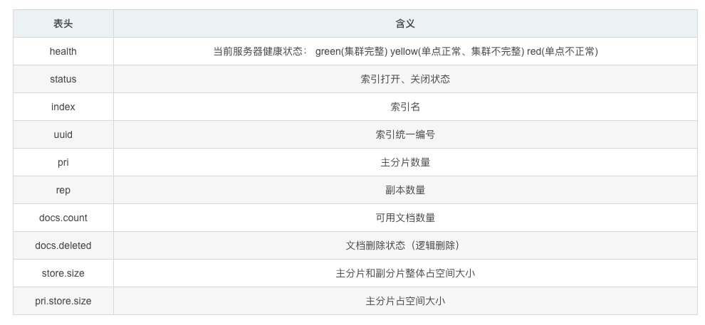
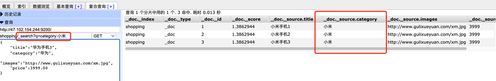

- [x] [官方网址](https://www.elastic.co/cn/)

- [x] [官方文档](https://www.elastic.co/guide/index.html)

- [X] [Elasticsearch 7.8.0下载页面](https://www.elastic.co/cn/downloads/past-releases/elasticsearch-7-8-0)

- [x] https://github.com/elastic/go-elasticsearch

- [x] [Elasticsearch: 权威指南 | Elastic](https://www.elastic.co/guide/cn/elasticsearch/guide/current/index.html)

- [x] [Elasticsearch学习笔记_csdn](https://blog.csdn.net/u011863024/article/details/115721328?ops_request_misc=%7B%22request%5Fid%22%3A%22166003248016782391810057%22%2C%22scm%22%3A%2220140713.130102334..%22%7D&request_id=166003248016782391810057&biz_id=0&utm_medium=distribute.pc_search_result.none-task-blog-2~all~top_positive~default-1-115721328-null-null.142^v39^control,185^v2^tag_show&utm_term=es&spm=1018.2226.3001.4187)

- [x] [go语言查找es实战驱动的初始化_哔哩哔哩](https://www.bilibili.com/video/BV1xV411m78w?p=12&vd_source=8321160752e4f07c473e11ebc0dd0a28)

- [x] https://olivere.github.io/elastic/

------

Elasticsearch 是一个分布式、可扩展、实时的搜索与数据分析引擎。 它能从项目一开始就赋予你的数据以搜索、分析和探索的能力，这是通常没有预料到的。 它存在还因为原始数据如果只是躺在磁盘里面根本就毫无用处。

无论你是需要全文搜索，还是结构化数据的实时统计，或者两者结合，这本指南都能帮助你了解其中最基本的概念， 从最基本的操作开始学习 Elasticsearch。之后，我们还会逐渐开始探索更加高级的搜索技术，不断提升搜索体验来满足你的需求。

Elasticsearch 不仅仅只是全文搜索，我们还将介绍结构化搜索、数据分析、复杂的人类语言处理、地理位置和对象间关联关系等。 我们还将探讨为了充分利用 Elasticsearch 的水平伸缩性，应当如何建立数据模型，以及在生产环境中如何配置和监控你的集群。

# 技术选型
## Elasticsearch 是什么
The Elastic Stack, 包括 Elasticsearch、 Kibana、 Beats 和 Logstash（也称为 ELK Stack）。能够安全可靠地获取任何来源、任何格式的数据，然后实时地对数据进行搜索、分析和可视化。

Elaticsearch，简称为 ES， ES 是一个开源的高扩展的分布式全文搜索引擎， 是整个 ElasticStack 技术栈的核心。

它可以近乎实时的存储、检索数据；本身扩展性很好，可以扩展到上百台服务器，处理 PB 级别的数据。

## 全文搜索引擎
Google，百度类的网站搜索，它们都是根据网页中的关键字生成索引，我们在搜索的时候输入关键字，它们会将该关键字即索引匹配到的所有网页返回；还有常见的项目中应用日志的搜索等等。对于这些非结构化的数据文本，关系型数据库搜索不是能很好的支持。

一般传统数据库，全文检索都实现的很鸡肋，因为一般也没人用数据库存文本字段。进行全文检索需要扫描整个表，如果数据量大的话即使对 SQL 的语法优化，也收效甚微。建立了索引，但是维护起来也很麻烦，对于 insert 和 update 操作都会重新构建索引。

基于以上原因可以分析得出，在一些生产环境中，使用常规的搜索方式，性能是非常差的：
- 搜索的数据对象是大量的非结构化的文本数据。 
- 文件记录量达到数十万或数百万个甚至更多。 
- 支持大量基于交互式文本的查询。 
- 需求非常灵活的全文搜索查询。 
- 对高度相关的搜索结果的有特殊需求，但是没有可用的关系数据库可以满足。 
- 对不同记录类型、非文本数据操作或安全事务处理的需求相对较少的情况。为了解决结构化数据搜索和非结构化数据搜索性能问题，我们就需要专业，健壮，强大的全文搜索引擎 。

**这里说到的全文搜索引擎指的是目前广泛应用的主流搜索引擎。** 它的工作原理是计算机索引程序通过扫描文章中的每一个词，对每一个词建立一个索引，指明该词在文章中出现的次数和位置，当用户查询时，检索程序就根据事先建立的索引进行查找，并将查找的结果反馈给用户的检索方式。这个过程类似于通过字典中的检索字表查字的过程。

## Elasticsearch 应用案例
GitHub: 2013 年初，抛弃了 Solr，采取 Elasticsearch 来做 PB 级的搜索。 “GitHub 使用Elasticsearch 搜索 20TB 的数据，包括 13 亿文件和 1300 亿行代码”。
- 维基百科：启动以 Elasticsearch 为基础的核心搜索架构 
- 百度：目前广泛使用 Elasticsearch 作为文本数据分析，采集百度所有服务器上的各类指标数据及用户自定义数据，通过对各种数据进行多维分析展示，辅助定位分析实例异常或业务层面异常。目前覆盖百度内部 20 多个业务线（包括云分析、网盟、预测、文库、直达号、钱包、 风控等），单集群最大 100 台机器， 200 个 ES 节点，每天导入 30TB+数据。 
- 新浪：使用 Elasticsearch 分析处理 32 亿条实时日志。 
- 阿里：使用 Elasticsearch 构建日志采集和分析体系。 
- Stack Overflow：解决 Bug 问题的网站，全英文，编程人员交流的网站。


------

# RestFul

## HTTP-索引-创建

对比关系型数据库，创建索引就等同于创建数据库。

在 Postman 中，向 ES 服务器发 PUT 请求 ： http://127.0.0.1:9200/shopping

请求后，服务器返回响应：

```json
{
  "acknowledged": true,//响应结果
  "shards_acknowledged": true,//分片结果
  "index": "shopping"//索引名称
}
```

## HTTP-索引-查询 & 删除

### 查看所有索引

GET 请求 ： http://127.0.0.1:9200/_cat/indices?v

这里请求路径中的_cat 表示查看的意思， indices 表示索引，所以整体含义就是查看当前 ES服务器中的所有索引，就好像 MySQL 中的 show tables 的感觉，服务器响应结果如下 :

```json
health status index    uuid                   pri rep docs.count docs.deleted store.size pri.store.size
yellow open   shopping J0WlEhh4R7aDrfIc3AkwWQ   1   1          0            0       208b           208b
```



### 查看单个索引

在 Postman 中，向 ES 服务器发 GET 请求 ： http://127.0.0.1:9200/shopping

```json
{
    "shopping": {//索引名
        "aliases": {},//别名
        "mappings": {},//映射
        "settings": {//设置
            "index": {//设置 - 索引
                "creation_date": "1617861426847",//设置 - 索引 - 创建时间
                "number_of_shards": "1",//设置 - 索引 - 主分片数量
                "number_of_replicas": "1",//设置 - 索引 - 主分片数量
                "uuid": "J0WlEhh4R7aDrfIc3AkwWQ",//设置 - 索引 - 主分片数量
                "version": {//设置 - 索引 - 主分片数量
                    "created": "7080099"
                },
                "provided_name": "shopping"//设置 - 索引 - 主分片数量
            }
        }
    }
}
```

### 删除索引

在 Postman 中，向 ES 服务器发 DELETE 请求 ： http://127.0.0.1:9200/shopping

```json
{
    "acknowledged": true
}
```

## HTTP-文档-创建（Put & Post）

假设索引已经创建好了，接下来我们来创建文档，并添加数据。这里的文档可以类比为关系型数据库中的表数据，添加的数据格式为 JSON 格式

在 Postman 中，向 ES 服务器发 POST 请求 ： http://127.0.0.1:9200/shopping/_doc，请求体JSON内容为：

```json
{
    "title":"小米手机",
    "category":"小米",
    "images":"http://www.gulixueyuan.com/xm.jpg",
    "price":3999.00
}
```

返回结果：

```json
{
    "_index": "shopping",//索引
    "_type": "_doc",//类型-文档
    "_id": "ANQqsHgBaKNfVnMbhZYU",//唯一标识，可以类比为 MySQL 中的主键，随机生成
    "_version": 1,//版本
    "result": "created",//结果，这里的 create 表示创建成功
    "_shards": {//
        "total": 2,//分片 - 总数
        "successful": 1,//分片 - 总数
        "failed": 0//分片 - 总数
    },
    "_seq_no": 0,
    "_primary_term": 1
}
```

上面的数据创建后，由于没有指定数据唯一性标识（ID），默认情况下， ES 服务器会随机生成一个。

### 自定义唯一性标识

如果想要自定义唯一性标识，需要在创建时指定： http://127.0.0.1:9200/shopping/_doc/1，请求体JSON内容为：

```json
{
    "title":"小米手机",
    "category":"小米",
    "images":"http://www.gulixueyuan.com/xm.jpg",
    "price":3999.00
}
```

返回结果如下：

```json
{
    "_index": "shopping",
    "_type": "_doc",
    "_id": "1",//<------------------自定义唯一性标识
    "_version": 1,
    "result": "created",
    "_shards": {
        "total": 2,
        "successful": 1,
        "failed": 0
    },
    "_seq_no": 1,
    "_primary_term": 1
}
```

**此处需要注意：如果增加数据时明确数据主键，那么请求方式也可以为 PUT。**

## HTTP-查询-[主键](https://so.csdn.net/so/search?q=主键&spm=1001.2101.3001.7020)查询 & 全查询

### 主键查询

查看文档时，需要指明文档的唯一性标识，类似于 MySQL 中数据的主键查询

在 Postman 中，向 ES 服务器发 GET 请求 ： http://127.0.0.1:9200/shopping/_doc/1 。

返回结果如下：

```json
{
    "_index": "shopping",
    "_type": "_doc",
    "_id": "1",
    "_version": 1,
    "_seq_no": 1,
    "_primary_term": 1,
    "found": true,
    "_source": {
        "title": "小米手机",
        "category": "小米",
        "images": "http://www.gulixueyuan.com/xm.jpg",
        "price": 3999
    }
}
```

查找不存在的内容，向 ES 服务器发 GET 请求 ： http://127.0.0.1:9200/shopping/_doc/1001。返回结果如下：

```json
{
    "_index": "shopping",
    "_type": "_doc",
    "_id": "1001",
    "found": false
}
```

### 全查询（查看索引下所有数据）

向 ES 服务器发 GET 请求 ： http://127.0.0.1:9200/shopping/_search

```json
{
    "took": 133,
    "timed_out": false,
    "_shards": {
        "total": 1,
        "successful": 1,
        "skipped": 0,
        "failed": 0
    },
    "hits": {
        "total": {
            "value": 2,
            "relation": "eq"
        },
        "max_score": 1,
        "hits": [
            {
                "_index": "shopping",
                "_type": "_doc",
                "_id": "ANQqsHgBaKNfVnMbhZYU",
                "_score": 1,
                "_source": {
                    "title": "小米手机",
                    "category": "小米",
                    "images": "http://www.gulixueyuan.com/xm.jpg",
                    "price": 3999
                }
            },
            {
                "_index": "shopping",
                "_type": "_doc",
                "_id": "1",
                "_score": 1,
                "_source": {
                    "title": "小米手机",
                    "category": "小米",
                    "images": "http://www.gulixueyuan.com/xm.jpg",
                    "price": 3999
                }
            }
        ]
    }
}
```

## HTTP-全量修改 & 局部修改 & 删除

### 全量修改

和新增文档一样，输入相同的 URL 地址请求，如果请求体变化，会将原有的数据内容覆盖

在 Postman 中，向 ES 服务器发 POST 请求 ： http://127.0.0.1:9200/shopping/_doc/1

请求体JSON内容为:

```json
{
    "title":"华为手机",
    "category":"华为",
    "images":"http://www.gulixueyuan.com/hw.jpg",
    "price":1999.00
}
```

修改成功后，服务器响应结果：

```json
{
    "_index": "shopping",
    "_type": "_doc",
    "_id": "1",
    "_version": 2,
    "result": "updated",//<-----------updated 表示数据被更新
    "_shards": {
        "total": 2,
        "successful": 1,
        "failed": 0
    },
    "_seq_no": 2,
    "_primary_term": 1
}
```

### 局部修改

修改数据时，也可以只修改某一给条数据的局部信息

在 Postman 中，向 ES 服务器发 POST 请求 ： http://127.0.0.1:9200/shopping/_update/1。

请求体JSON内容为:

```json
{
	"doc": {
		"title":"小米手机",
		"category":"小米"
	}
}
```

返回结果如下：

```json
{
    "_index": "shopping",
    "_type": "_doc",
    "_id": "1",
    "_version": 3,
    "result": "updated",//<-----------updated 表示数据被更新
    "_shards": {
        "total": 2,
        "successful": 1,
        "failed": 0
    },
    "_seq_no": 3,
    "_primary_term": 1
}
```

### 删除

删除一个文档不会立即从磁盘上移除，它只是被标记成已删除（逻辑删除）。

在 Postman 中，向 ES 服务器发 DELETE 请求 ： http://127.0.0.1:9200/shopping/_doc/1

返回结果：

```json
{
    "_index": "shopping",
    "_type": "_doc",
    "_id": "1",
    "_version": 4,
    "result": "deleted",//<---删除成功
    "_shards": {
        "total": 2,
        "successful": 1,
        "failed": 0
    },
    "_seq_no": 4,
    "_primary_term": 1
}
```

向 ES 服务器发 GET请求 ： http://127.0.0.1:9200/shopping/_doc/1，查看是否删除成功：

```json
{
    "_index": "shopping",
    "_type": "_doc",
    "_id": "1",
    "found": false
}
```

## HTTP-条件查询 & 分页查询 & 查询排序

### 条件查询

#### URL带参查询

查找category为小米的文档，在 Postman 中，向 ES 服务器发 GET请求 ： http://127.0.0.1:9200/shopping/_search?q=category:小米，



URL带参数形式查询，这很容易让不善者心怀恶意，或者参数值出现中文会出现乱码情况。为了避免这些情况，我们可用使用带JSON请求体请求进行查询。

#### 请求体带参查询

接下带JSON请求体，还是**查找category为小米的文档**，在 Postman 中，向 ES 服务器发 GET请求 ： http://127.0.0.1:9200/shopping/_search，附带JSON体如下：

```json
{
	"query":{
		"match":{
			"category":"小米"
		}
	}
}
```

#### 带请求体方式的查找所有内容

**查找所有文档内容**，也可以这样，在 Postman 中，向 ES 服务器发 GET请求 ： http://127.0.0.1:9200/shopping/_search，附带JSON体如下：

```json
{
	"query":{
		"match_all":{}
	}
}
```

#### 查询指定字段

**如果你想查询指定字段**，在 Postman 中，向 ES 服务器发 GET请求 ： http://127.0.0.1:9200/shopping/_search，附带JSON体如下：

```json
{
	"query":{
		"match_all":{}
	},
	"_source":["title"]
}
```

### 分页查询

在 Postman 中，向 ES 服务器发 GET请求 ： http://127.0.0.1:9200/shopping/_search，附带JSON体如下：

```json
{
	"query":{
		"match_all":{}
	},
	"from":0,
	"size":2
}
```

### 查询排序

如果你想通过排序查出价格最高的手机，在 Postman 中，向 ES 服务器发 GET请求 ： http://127.0.0.1:9200/shopping/_search，附带JSON体如下：

```json
{
	"query":{
		"match_all":{}
	},
	"sort":{
		"price":{
			"order":"desc"
		}
	}
}
```


## HTTP-多条件查询 & 范围查询

### 多条件查询

假设想找出小米牌子，价格为3999元的。（must相当于数据库的&&）

在 Postman 中，向 ES 服务器发 GET请求 ： http://127.0.0.1:9200/shopping/_search，附带JSON体如下：

```json
{
	"query":{
		"bool":{
			"must":[{
				"match":{
					"category":"小米"
				}
			},{
				"match":{
					"price":3999.00
				}
			}]
		}
	}
}
```


### 范围查询

假设想找出小米和华为的牌子，价格大于2000元的手机。

在 Postman 中，向 ES 服务器发 GET请求 ： http://127.0.0.1:9200/shopping/_search，附带JSON体如下：

```json
{
	"query":{
		"bool":{
			"should":[{
				"match":{
					"category":"小米"
				}
			},{
				"match":{
					"category":"华为"
				}
			}],
            "filter":{
            	"range":{
                	"price":{
                    	"gt":2000
                	}
	            }
    	    }
		}
	}
}
```

## HTTP-全文检索 & 完全匹配 & 高亮查询

### 全文检索

这功能像搜索引擎那样，如品牌输入“小华”，返回结果带回品牌有“小米”和华为的。

在 Postman 中，向 ES 服务器发 GET请求 ： http://127.0.0.1:9200/shopping/_search，附带JSON体如下：

```json
{
	"query":{
		"match":{
			"category" : "小华"
		}
	}
}
```

### 完全匹配

在 Postman 中，向 ES 服务器发 GET请求 ： http://127.0.0.1:9200/shopping/_search，附带JSON体如下：

```json
{
	"query":{
		"match_phrase":{
			"category" : "为"
		}
	}
}
```

### 高亮查询

在 Postman 中，向 ES 服务器发 GET请求 ： http://127.0.0.1:9200/shopping/_search，附带JSON体如下：

```json
{
	"query":{
		"match_phrase":{
			"category" : "为"
		}
	},
    "highlight":{
        "fields":{
            "category":{}//<----高亮这字段
        }
    }
}
```

##  HTTP-聚合查询

聚合允许使用者对 es 文档进行统计分析，类似与关系型数据库中的 group by，当然还有很多其他的聚合，例如取最大值max、平均值avg等等。

接下来按price字段进行分组：

在 Postman 中，向 ES 服务器发 GET请求 ： http://127.0.0.1:9200/shopping/_search，附带JSON体如下：

```json
{
	"aggs":{//聚合操作
		"price_group":{//名称，随意起名
			"terms":{//分组
				"field":"price"//分组字段
			}
		}
	}
}
```

## HTTP-映射关系

有了索引库，等于有了数据库中的 database。

接下来就需要建索引库(index)中的映射了，类似于数据库(database)中的表结构(table)。

创建数据库表需要设置字段名称，类型，长度，约束等；索引库也一样，需要知道这个类型下有哪些字段，每个字段有哪些约束信息，这就叫做映射(mapping)。

### 先创建一个索引：

```json
# PUT http://127.0.0.1:9200/user
```

### 创建映射

```json
# PUT http://127.0.0.1:9200/user/_mapping

{
    "properties": {
        "name":{
        	"type": "text",
        	"index": true
        },
        "sex":{
        	"type": "keyword",
        	"index": true
        },
        "tel":{
        	"type": "keyword",
        	"index": false
        }
    }
}
```

### 查询映射

```json
#GET http://127.0.0.1:9200/user/_mapping
```

### 增加数据

```json
#PUT http://127.0.0.1:9200/user/_create/1001
{
	"name":"小米",
	"sex":"男的",
	"tel":"1111"
}
```

### 查找name含有”小“数据：

```json
#GET http://127.0.0.1:9200/user/_search
{
	"query":{
		"match":{
			"name":"小"
		}
	}
}
```

### 查找sex含有”男“数据：

```json
#GET http://127.0.0.1:9200/user/_search
{
	"query":{
		"match":{
			"sex":"男"
		}
	}
}
```

找不想要的结果，只因创建映射时"sex"的类型为"keyword"。

"sex"只能完全为”男的“，才能得出原数据。

```json
#GET http://127.0.0.1:9200/user/_search
{
	"query":{
		"match":{
			"sex":"男的"
		}
	}
}
```

### 查询电话

```json
# GET http://127.0.0.1:9200/user/_search
{
	"query":{
		"match":{
			"tel":"11"
		}
	}
}
```

报错只因创建映射时"tel"的"index"为false。